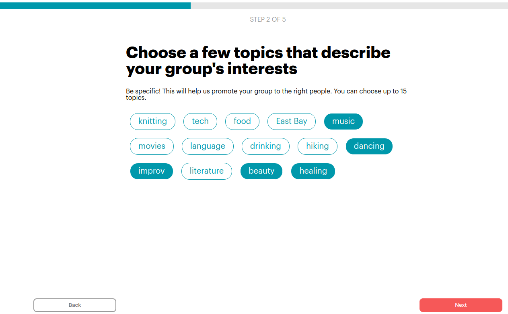

# README

[Get Together And...](https://get-together-and.herokuapp.com/) a Meetup.com clone

## Summary of the project
This is a clone of Meetup.com. It allows users to create groups, becoming their organizer, as well as to join or leave existing groups as a member. Organizers can edit their groups including adding a cover photo, as well as to delete their group. They can also create, delete, and edit events. Users can see a list of groups that they can join or unjoin, as well as upcoming events they can find through a clickable calendar. They can also sign up for events and change their RSVP, independently of their group membership. Users can also search for groups and events.

## Instructions

Click Sign Up to create a user. You will then be directed to a home feed, which displays a feed of the upcoming events and available groups. You can also create a group by clicking on the Start a new group link.


After creating a group, you will see a group's homepage. If you are the owner, you can edit the group info and add / edit events. If you are not the owner, you can join / leave a group.


From the Group Show page, you can also view events that you can RSVP for, or edit if you are the group organizer.


The event show page also links back to the group home page.

From any page, you can search for groups and events in the search bar at the top of the page.


## Technologies Used

The website uses a Rails backend connected to a postgreSQL database. Images are stored on AWS S3, referenced in Rails ActiveRecord. The frontend is served by React 18 and React Router v6. State is managed by Redux, which fetches data from Rails, using the JBuilder gem to return data back in JSON form.

### Backend Architecture
## Schema
The wiki [schema](https://github.com/canjalal/get_together/wiki/schema) describes the SQL tables used, as well as the associations that Rails ActiveRecord uses between them.

The main join tables are:
* users are linked to groups via memberships
* users are linked to events via signups
* keywords are linked to groups via groupkeywords

## Routes
Rails routes are defined as follows:

```
    resources :users, only: [:show, :create]
    resource :session, only: [:show, :create, :destroy]
    resources :keywords, only: [:index]
    resources :groups, only: [:create, :show, :update, :index, :destroy] do
      resources :memberships, only: [:create]
      collection do
        post 'search'
      end
    end
    resources :memberships, only: [:destroy]
    resources :events, only: [:create, :show, :update, :index, :destroy] do
      resources :signups, only: [:create]
      collection do
        post 'search'
        post 'weekly'
      end
    end
    resources :signups, only: [:update]
  end
end

```

Of note are the nestings of memberships and signups creation routes under groups and events respectively. This is for easy access to the group / event under which the record is being created, from the URL, rather than as an additional passed parameter.

There are custom routes for searching (`search`) groups, events, and finding events for a given week (`weekly`)

To allow the organizer to keep track of how many people signed up for an event but later changed their RSVP to "no", there is no backend route to "delete" a signup, only to update a signup's `rsvp_status` flag from "going" to "not" (going):

```
def update
        @event = Event.find_by(id: params[:id])
        @su = @event.signups.find_by(attendee_id: current_user.id)
        if(@su)
            @su.rsvp_status = @su.rsvp_status == "going" ? "not" : "going"
            @su.save!
            render :show
        else
            render json: {errors: @su.errors.full_messages }, status: :unprocessable_entity
        end
end
```
### Frontend Architecture

## React Page Structure

Pages consist of a navigation header element, consistent for all pages except for the multi-page New Group Form, as well as a body whose content depends on the front end route. The navigation header's elements change depending on the logged-in state and user.

## Redux Store
The store is structured around the following reducers:

* users
* session
* group
* memberships
* events
* signups
* keywords
* groupkeywords

The session slice of state stores the current logged-in user, as well as data for the home feed (user's groups and events), and finally, any search result queries for events and groups.

```
const sessionReducer = (state = initialState, action) => {
    Object.freeze(state);

    switch(action.type) {
        case SET_SESSION_USER:
            return { ...state, user: action.payload };
        case REMOVE_SESSION_USER:
            return { ...state, user: null};
        case ADD_GROUPS: 
            return { ...state,
                joinedGroups: action.payload.joinedGroups,
                ownedGroups: action.payload.ownedGroups,
                otherGroups: action.payload.otherGroups
            } 
        case ADD_SEARCHED_GROUPS:
            return { ...state,
                searchedGroups: action.payload.groups
            }
        case ADD_SEARCHED_EVENTS:
                return { ...state,
                    searchedEvents: action.payload.events
                }
        default:
            return state;
    }

}
export default sessionReducer;

```

This decision was made due to these data being specific to either the current user's session-specific queries, or due to being on the home feed page.

## New Group Form

Like in the actual Meetup.com form, this is a multi-page form with different design elements (header, styling, footer) than the main site. The pages are components toggled through a switch case statement. To keep track of its data across the multiple pages, a formData prop is passed between the pages: 
```
    const [formData, setFormData] = useState({
        location: "",
        keywordIds: "",
        name: "",
        description: ""
    });

    const [pageNum, setPageNum] = useState(1);

    const [pageisDone, setPageisDone] = useState(false); // whether Next button is enabled

    const pickElement = (page) => { // pass in the page number
        switch(page) {
            case 1:
                return <GroupLocationForm
                        formData={formData} setFormData={setFormData}
                        setPageisDone={setPageisDone} pageisDone={pageisDone} />
            case 2:
                return <GroupKeywordsForm
                    formData={formData} setFormData={setFormData}
                    setPageisDone={setPageisDone} />
            case 3:
                return <GroupNameForm
                    formData={formData} setFormData={setFormData}
                    setPageisDone={setPageisDone} />
            case 4:
                return <GroupDescriptionForm
                    formData={formData} setFormData={setFormData}
                    setPageisDone={setPageisDone} pageisDone={pageisDone} />
            default:
                 return <GroupGuidelinesForm
                    setPageisDone={setPageisDone} />
        }
    }
```
Users may only move to the next page if they complete the page's form, i.e. whether the current form page is "done". When this `pageisDone` state is set to true, the user may click Next to change the page number, which triggers a switch case to choose the next React component corresponding to the appropriate form page.

### Choosing Group Keywords




Instead of checkboxes, which are difficult to style, a group organizer chooses keywords by clicking on various `GroupKeyword` components which are elements whose `click` handler toggles their `checked` / `unchecked` CSS class:

```
            <form id="kw-form">
                { keywordList.map((kw) => <GroupKeyword key={kw.id} kw={kw} toggleItem={toggleItem} isChecked={!!checkedKeywords[kw.id]} />)}
            </form>
...
export const GroupKeyword = ({kw, isChecked, toggleItem}) => {

    const [keywordClass, setKeywordClass] = useState("");

    useEffect(()=>{
        if(isChecked) {
            setKeywordClass("kw-checkbox kw-checked");
        } else {
            setKeywordClass("kw-checkbox kw-unchecked");
        }
    }, [isChecked]);
  return (
    <p id={`kw-${kw.id}`} className={keywordClass} onClick={toggleItem(kw.id)}> 
{kw.keyword}
    </p>
  )
}

```

The click event handler, `toggleItem`, also updates the `checkedKeywords` object, a React state that stores which keywords are to be registered with the group. This object is saved to the `formData`:

```
    const [checkedKeywords, setCheckedKeywords] = useState(formData.keywordIds);

    const toggleItem = (id) => () => {
        const tempKeywordIds = {...checkedKeywords}
        if(tempKeywordIds[id]) {
            delete tempKeywordIds[id]; // remove unselected keyword
        } else {
            tempKeywordIds[id] = true; // add new selected keyword
        }
        setCheckedKeywords({...tempKeywordIds}); // save keywords
    }

    useEffect(() => { // save to formData prop

        setFormData({
            ...formData, keywordIds: {...checkedKeywords}
        });

        setPageisDone(Object.keys(checkedKeywords).length !== 0); // Ensure user selects at least one keyword

    }, [checkedKeywords])
```

In this way, the entire form is notified immediately of the user's choices, allowing validation (there must be at least one keyword selected).

# Upcoming features
In the future, there will be a group administration page allowing group organizers to directly delete members. On the top right drop down menu, users will be able to see all events they signed up for, all groups, and for them to create a user page where they can list their interests.
