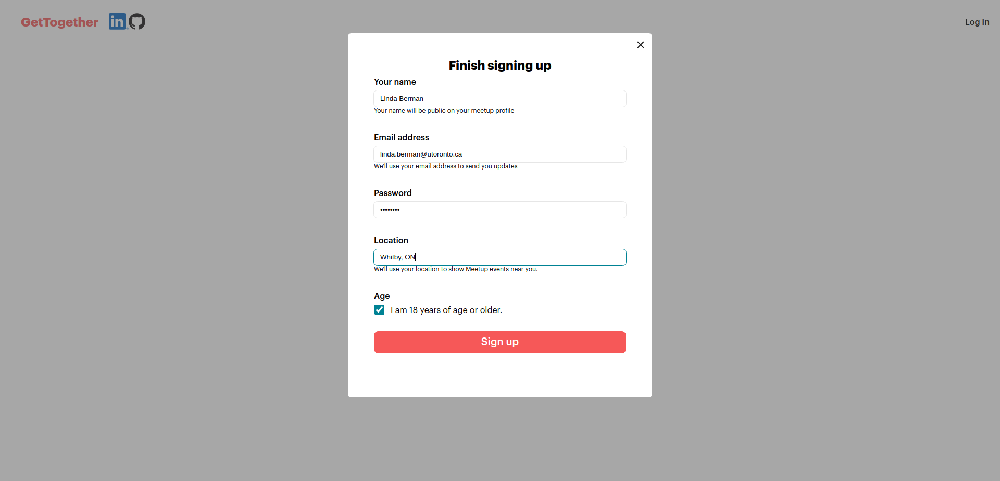
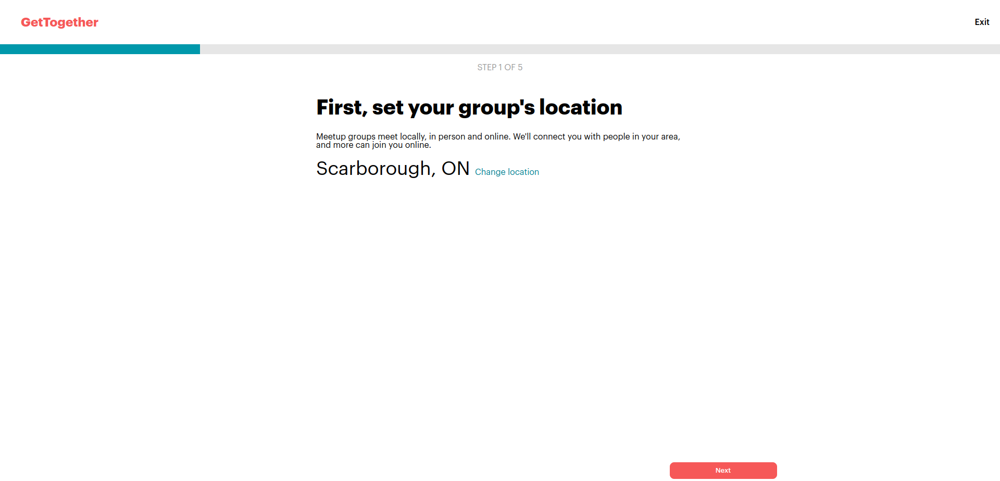
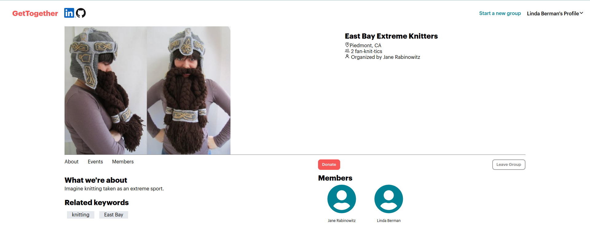
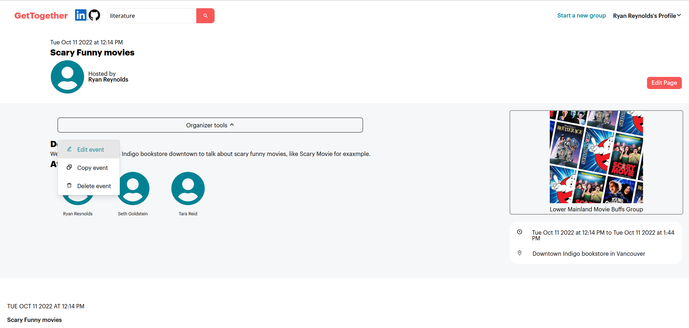
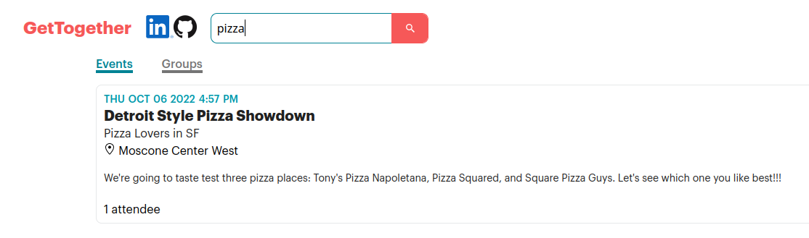

# README

[Get Together And...](https://get-together-and.herokuapp.com/) a Meetup.com clone

## Summary of the project
This is a clone of Meetup.com. It allows users to create groups, becoming their organizer, as well as to join or leave existing groups as a member. Organizers can edit their groups including adding a cover photo, as well as to delete their group. They can also create, delete, and edit events. Users can see a list of groups that they can join or unjoin, as well as upcoming events they can find through a clickable calendar. They can also sign up for events and change their RSVP, independently of their group membership. Users can also search for groups and events.

## Instructions

Click Sign Up to create a user. You will then be directed to a home feed, which displays a feed of the upcoming events and available groups. You can also create a group by clicking on the Start a new group link.

After creating a group, you will see a group's homepage. If you are the owner, you can edit the group info and add / edit events. If you are not the owner, you can join / leave a group.

From the Group Show page, you can also view events that you can RSVP for, or edit if you are the group organizer.

The event show page also links back to the group home page.

From any page, you can search for groups in the search bar above.

## Technologies Used

The website uses a Rails backend connected to a postgreSQL database. Images are stored on AWS S3, referenced in Rails ActiveRecord. The frontend is served by React 18 and React Router v6.